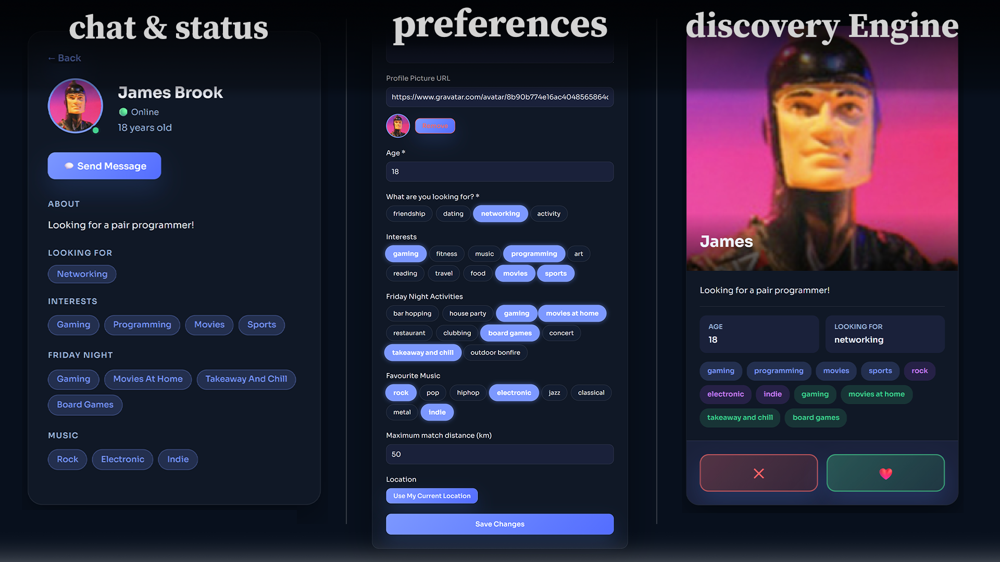

# Match-Me

A people recommendation and messaging platform. Users are matched based on interests, music taste, relationship goals, location and then can connect and chat in real time.

**[Try the live demo →](https://match-me-demo.tanelneitov.eu)**  
(note: the demo does store any data.)



---

## Tech Stack

| Layer            | Technology                   |
|------------------|------------------------------|
| Backend          | Java 21, Spring Boot         |
| Database         | H2 (dev) / PostgreSQL (prod) |
| Frontend         | React, TypeScript, Vite      |
| Auth             | JWT + bcrypt                 |
| Real-time        | Socket.IO                    |
| CI/CD            | GitHub Actions               |
| Containerization | Docker                       |

---

## Architecture & Design Decisions

**Matching algorithm** — candidates are scored across 5 dimensions: interests, Friday night activity, music genres, relationship goal, and age. Location acts as a hard filter before scoring — only users within the chosen radius are considered. The top 10 scoring matches are returned.

**Real-time** — Socket.IO runs on a separate port (3001) from the REST API (3000). The client connects on login and disconnects on logout. Typing indicators, unread counts, and new messages are all pushed over the socket with no polling.

**Profile pictures** — users can provide a custom image URL. If none is set, the backend derives a Gravatar URL from the email. No file storage needed.

**Location** — GPS coordinates are requested from the browser via the Geolocation API and stored on the profile. They are used only as a filter and never exposed directly to other users.

**Profile visibility** — user profiles are only accessible if there is an existing recommendation, pending request, or accepted connection between the two users. The API returns 404 for both "not found" and "not permitted" to avoid confirming a user's existence.

**Demo mode** — the frontend supports a `demo` build mode powered by MSW (Mock Service Worker). All API calls are intercepted client-side with no backend required. Seeded mock users respond to messages with scripted replies. Deployed automatically to the demo domain on every push to `main`.

---

## Running Locally

### Prerequisites

- Java 21
- Node.js v18+ and npm

> Maven is not required — the project includes a Maven wrapper (`mvnw`) that downloads it automatically.

### 1. Start the backend

```bash
cd server
cp .env.example .env
```

```bash
# Mac/Linux
chmod +x ./mvnw
./mvnw spring-boot:run

# Windows
mvnw.cmd spring-boot:run
```

Runs on **http://localhost:3000**. Uses an in-memory H2 database by default — no database setup needed.

### 2. Start the frontend

```bash
cd client
cp .env.example .env   # Windows: copy .env.example .env
npm install
npm run dev
```

Runs on **http://localhost:5173**.

---

## Docker

Docker Compose starts the backend and a PostgreSQL database together:

```bash
docker compose up -d
```

Then start the frontend separately with `npm run dev` as above.

To seed the database with mock users, create a `.env` file in the project root:

```
SEED_DATABASE=true
SEED_USER_COUNT=200
```

All seeded users have the password `password`.

---

## Environment Variables

### Backend (`server/.env`)

| Variable           | Default                 | Description                                      |
|--------------------|-------------------------|--------------------------------------------------|
| `PORT`             | `3000`                  | HTTP server port                                 |
| `SOCKETIO_PORT`    | `3001`                  | Socket.IO server port                            |
| `JWT_SECRET`       | (dev default)           | Secret for signing JWTs — change in production   |
| `JWT_EXPIRATION`   | `86400000`              | Token lifetime in ms (24 h)                      |
| `DDL_AUTO`         | `create-drop`           | Set to `update` to persist data between restarts |
| `SHOW_SQL_QUERIES` | `false`                 | Log SQL queries to console                       |
| `SEED_DATABASE`    | `false`                 | Seed the database with mock users on startup     |
| `SEED_USER_COUNT`  | `100`                   | Number of users to seed                          |
| `DATABASE_URL`     | `jdbc:h2:mem:matchmedb` | Database connection URL                          |
| `DB_USERNAME`      | `sa`                    | Database username                                |
| `DB_PASSWORD`      | _(empty)_               | Database password                                |
| `DB_DRIVER`        | `org.h2.Driver`         | JDBC driver class                                |

### Frontend (`client/.env`)

| Variable            | Default                 | Description          |
|---------------------|-------------------------|----------------------|
| `VITE_API_URL`      | `http://localhost:3000` | Backend API URL      |
| `VITE_SOCKETIO_URL` | `http://localhost:3001` | Socket.IO server URL |

---

## API

See [API.md](./API.md) for full endpoint documentation.

---

## Credits

Andreas Taavi Talu  
Tauri Metsis  
Tanel Erik Neitov